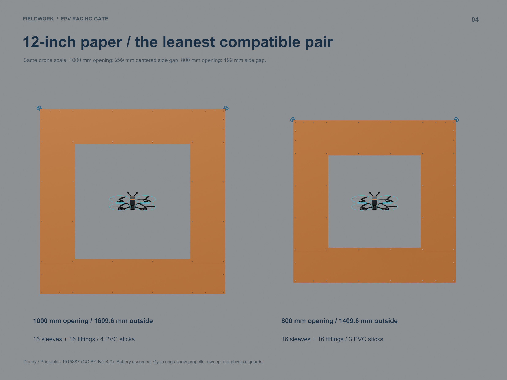
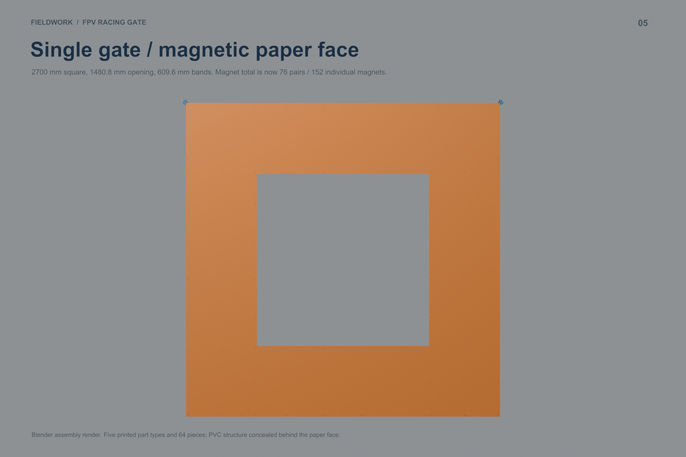
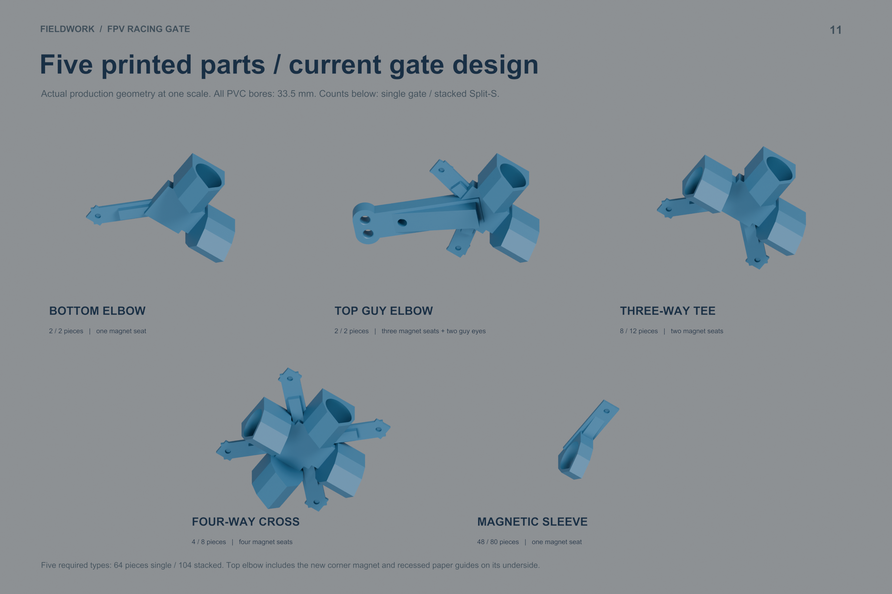
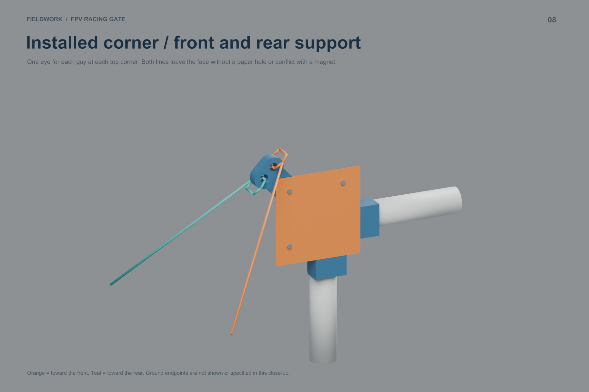
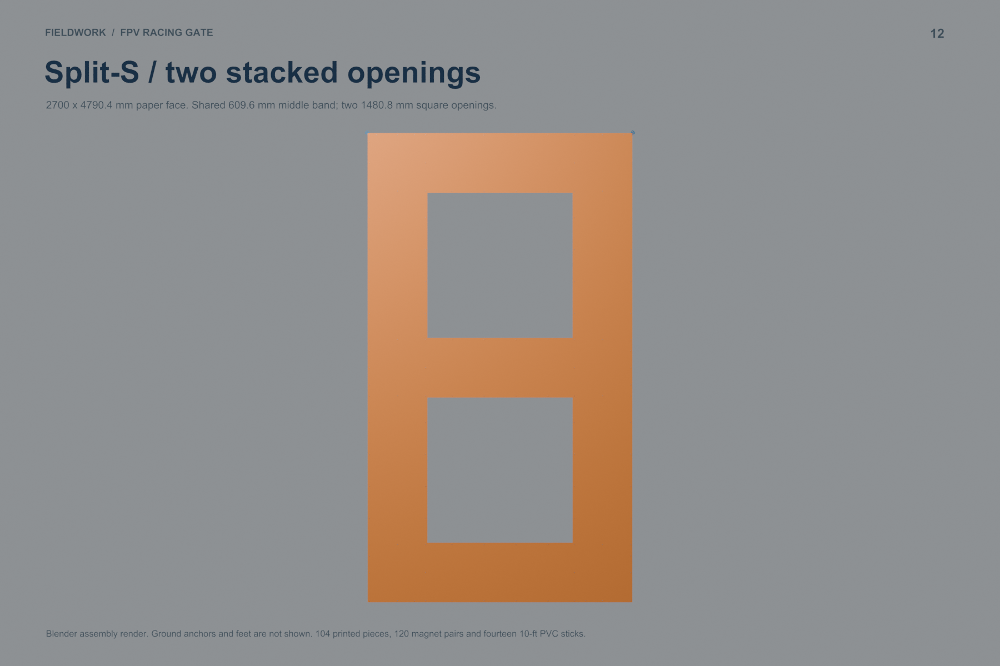
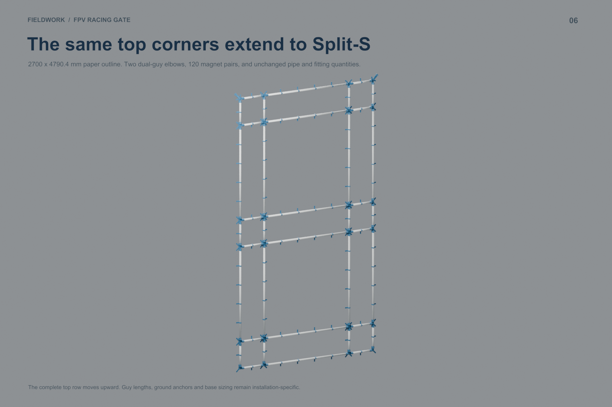

# FPV Drone Racing Gate

A modular FPV race gate built from **1-inch PVC, five types of PETG fittings, roll paper and magnets**. Print the fittings on a Bambu A1 Mini, cut two standard pipe lengths, and assemble a single gate or a two-level Split-S obstacle.

**Current design:** three-magnet top elbows with independent front/rear guy eyes and recessed paper alignment guides. **Prototype status:** the 33.5 mm magnetic sleeve bore has been physically tested on the purchased PVC and fits well. Full-gate assembly, friction-joint retention and guy loads still need physical validation.

## Choose a gate size

The original **1480.8 mm opening** now has **1000 mm and 800 mm alternatives**, each available with **24-, 18- or 12-inch paper bands**. All use the **same five printed part types and accepted 33.5 mm bores**. Only PVC lengths, paper cuts and sleeve quantities/positions change; previously printed fittings remain usable.

**Suggested next trial: 1000 mm opening with 12-inch paper.** It needs 32 printed parts, 1.883 kg PETG and about 74 hours of printing—half the original part count, 19% less PETG and 21% less printer time. Its outside square is 1609.6 mm. The imported 7-inch MK4 drone has about 299 mm centered clearance on each side; the 800 mm opening has about 199 mm. These are geometric clearances, not flight-error allowances.



| Clear square opening | Paper band | Outside square | All parts / sleeves | PETG | Estimated print time | 10-ft PVC sticks* | Priced subtotal* |
|---:|---:|---:|---:|---:|---:|---:|---:|
| 1000 mm | 24 in | 2219.2 mm | 48 / 32 | 2.104 kg | 84 h 20 min | 5 | $50.52 |
| 1000 mm | 18 in | 1914.4 mm | 40 / 24 | 1.993 kg | 79 h 18 min | 5 | $49.03 |
| 1000 mm | 12 in | 1609.6 mm | 32 / 16 | 1.883 kg | 74 h 21 min | 4 | $42.19 |
| 800 mm | 24 in | 2019.2 mm | 48 / 32 | 2.104 kg | 84 h 20 min | 5 | $50.52 |
| 800 mm | 18 in | 1714.4 mm | 40 / 24 | 1.993 kg | 79 h 18 min | 4 | $43.69 |
| 800 mm | 12 in | 1409.6 mm | 32 / 16 | 1.883 kg | 74 h 21 min | 3 | $36.85 |

*Compact-gate stock counts and subtotals above use the **ratcheting-cutter layouts**, with 10 mm cleanup reserve per stick and no saw kerf. Subtotals cover PETG consumed, magnets and whole PVC sticks at the owner's prices; paper, guys and ground supports are additional. The earlier compact study's cost table reserves 3 mm per cut for a saw, so its 1000 mm / 24-inch option uses six sticks and costs $5.34 more. Print figures are Bambu Studio estimates, not elapsed measurements.*

All compact gates retain **2 bottom elbows, 2 guy elbows, 8 tees and 4 crosses**. Their 24 / 18 / 12-inch paper layouts need **32 / 24 / 16 sleeves**, respectively. The smaller 800 mm opening uses the same print quantities at the study's maximum 350 mm magnet-gap target; paper retention at that spacing still needs physical testing. A 12-inch-paper gate fits nominally within two 1 kg spools, with about 117 g spare before failures.

- **Cut the PVC:** [printable seven-page cut guide](output/compact_gate_study/PVC_Cut_Guide.pdf), [cut tables and stick layouts](output/compact_gate_study/PVC_Cut_Guide.md), or [summary CSV](output/compact_gate_study/PVC_Cut_Summary.csv). Every compact gate needs eight long and sixteen short pieces. Listed lengths already include socket insertion.
- **See all six sizes:** [paper-on preview](output/compact_gate_study/renders/01_SIX_PAPER_LAYOUTS.png), [1000 mm frames with paper removed](output/compact_gate_study/renders/02_FRAME_1000.png), [800 mm frames](output/compact_gate_study/renders/03_FRAME_800.png), and [compact corner detail](output/compact_gate_study/renders/05_NARROW_CORNER_DETAIL.png).
- **Build a selected variant:** [full study, per-variant print queues, paper cuts and sleeve positions](output/compact_gate_study/README.md), [illustrated PDF](output/compact_gate_study/Compact_Gate_Study.pdf), or [Blender model](output/compact_gate_study/Compact_Gate_Study.blend).
- **Compare drone clearance:** [MK4 clearance study](output/drone_clearance_study/README.md) and [equal-scale opening comparison](output/drone_clearance_study/renders/04_OPENING_DETAIL.png). Drone reference: Dendy / Printables 1515387, CC BY-NC 4.0; battery dimensions assumed. See [attribution](reference/geprc_mk4/ATTRIBUTION.md).

## Original gate and stacked Split-S

The quantities and assembly tables below describe the original **1480.8 mm opening / 24-inch paper** configuration and its stacked version. Use the compact cut guide and print queue above for smaller gates. Compact stacked variants have not been laid out in this study.



*Blender assembly render—not a photograph of a completed build. Blue parts in the renders represent the black PETG used for printing. Ground anchoring and feet are not shown.*

| | Single gate | Stacked Split-S, total |
|---|---:|---:|
| Paper outline | 2700 × 2700 mm | 2700 × 4790.4 mm |
| Clear square opening | 1480.8 × 1480.8 mm | Two 1480.8 × 1480.8 mm openings |
| Paper band width | 609.6 mm / 24 in | 609.6 mm / 24 in |
| Printed parts / unique types | 64 / 5 | 104 / 5 |
| PETG, full batch queue | 2.325 kg | 3.691 kg |
| Estimated printer time | 94 h 28 min | 150 h 22 min |
| Plate runs on one A1 Mini | 23 | 36 |
| Priced materials: PETG + magnets + PVC | **$69.53** | **$117.29** |

Paper, guy lines and ground support are additional. Prices are the owner's approximate purchase costs, detailed below. The two guy ears extend about 28.6 mm beyond the adjacent paper edges.

## Files to start with

- [Compact gate material study](output/compact_gate_study/README.md): 1000 / 800 mm openings with 24 / 18 / 12-inch paper, fewer sleeves, exact print queues and material comparisons.
- [PVC cut guide for all six compact variants](output/compact_gate_study/PVC_Cut_Guide.pdf): finished lengths, quantities and stock layouts for the ratcheting cutter.
- [7-inch MK4 drone clearance study](output/drone_clearance_study/README.md): actual imported drone, Blender renders and 1480.8 / 1200 / 1000 / 800 mm opening comparisons. Smaller sizes are study variants; the production kit below retains the 1480.8 mm opening.
- [Current Blender model](output/corner_guide_elbow/Corner_Guide_Elbow.blend), including assembled gates, paper alignment, cord routing and the five-part overview.
- [Illustrated assembly and test PDF](output/corner_guide_elbow/Corner_Guide_Elbow.pdf) and [detailed current guide](output/corner_guide_elbow/README.md).
- [Printable STL parts](output/corner_guide_elbow/printable/) and [prepared A1 Mini PETG projects](output/corner_guide_elbow/sliced/).
- [Single-gate print queue](output/corner_guide_elbow/single_Print_Queue.csv), [PVC stock layout](output/corner_guide_elbow/single_PVC_Stock_Layout.csv), [paper cuts](output/corner_guide_elbow/single_Paper_Cuts.csv) and [magnet positions](output/corner_guide_elbow/single_Magnet_Positions.csv).
- [Stacked print queue](output/corner_guide_elbow/split_s_Print_Queue.csv) and [cost BOM](docs/Cost_BOM.csv).

Use **`output/corner_guide_elbow/`** for the shared fitting geometry and original gate, **`output/compact_gate_study/`** for the six smaller layouts, and **`output/drone_clearance_study/`** for drone size comparisons. Other output folders preserve earlier iterations; their quantities, interfaces and prices may differ.

## Five printed parts



| Part / STL | Single qty | Stacked total qty | PETG per individual print | Individual print time | PETG cost per individual print |
|---|---:|---:|---:|---:|---:|
| [Bottom elbow](output/corner_guide_elbow/printable/ELBOW.stl) | 2 | 2 | 68.47 g | 2 h 41 min | $0.68 |
| [Top guy elbow](output/corner_guide_elbow/printable/DUAL_GUY_ELBOW.stl) | 2 | 2 | 103.06 g | 4 h 00 min | $1.02 |
| [Three-way tee](output/corner_guide_elbow/printable/TEE.stl) | 8 | 12 | 98.49 g | 3 h 46 min | $0.97 |
| [Four-way cross](output/corner_guide_elbow/printable/CROSS.stl) | 4 | 8 | 132.59 g | 5 h 04 min | $1.31 |
| [Magnetic sleeve](output/corner_guide_elbow/printable/MAG_SLEEVE.stl) | 48 | 80 | 13.88 g | 1 h 12 min | $0.14 |

Individual print estimates include each plate's overhead. The full-gate totals use **seven-sleeve batches**, which are substantially faster than printing sleeves one at a time. Values come from local Bambu Studio slices, not elapsed measurements of completed prints. Full queues start from zero; subtract parts already printed.

The bottom elbow, tee, cross and sleeve are unchanged from the accepted-bore iteration. All sockets use **33.5 mm bores** for the project's nominal 1-inch PVC (modeled OD 33.4 mm). Elbows, tees and crosses have 30 mm pipe engagement; the sleeve has 16 mm engagement. Friction retains the joints—no bolts, nuts or zip ties in this frame.

The top elbow adds two separate 10.5 mm eyes for front and rear guys, three 6 × 2 mm magnet seats, and an L-shaped paper guide recessed 0.4 mm into the face. The magnet pockets retain 0.4 mm plastic skins. Bare front magnets clamp the paper against those skins; front paper pads are optional and excluded from the required BOM.

## Material BOM and costs

These are **prices paid by the project owner**, not current store quotes or product recommendations. Exact brands/listings were not supplied.

| Material purchased | Pack price | Unit rate used |
|---|---:|---:|
| Black PETG, four 1 kg spools | $39.59 / 4 kg | $9.8975 / kg |
| Neodymium magnets, 6 mm diameter × 2 mm thick | $19.99 / 800 | $0.0249875 / magnet |
| Nominal 1-inch PVC, 10 ft / 3048 mm stick | $5.34 each | $5.34 / stick |

| Material | Single quantity | Single cost | Stacked total quantity | Stacked cost |
|---|---:|---:|---:|---:|
| PETG consumed by supplied queue | 2.32471 kg | $23.01 | 3.69130 kg | $36.53 |
| Magnets, including both sides of paper | 152 / 76 pairs | $3.80 | 240 / 120 pairs | $6.00 |
| PVC stock, including cutting waste | 8 sticks | $42.72 | 14 sticks | $74.76 |
| **Priced material subtotal** | | **$69.53** | | **$117.29** |
| 24-inch paper roll | 8.5056 m used | Unpriced | 14.3112 m used | Unpriced |
| Front/rear guys and suitable ground support | 4 guys + supports | Unpriced | 4 guys + supports | Unpriced |

These subtotals allocate only the filament and magnets used, plus all PVC sticks purchased. Starting from no supplies, buying **one 4 kg filament pack + one 800-magnet pack + the PVC** costs **$102.30 single / $134.34 stacked**, leaving filament, magnets and pipe offcuts. The stacked queue fits nominally within 4 kg, with about 309 g spare before failed prints or other additions. Tax, shipping, adhesive, electricity, optional pads, tools, failed prints, paper and ground support are excluded.

Machine-readable inputs: [material_costs.json](docs/material_costs.json). [Cost_BOM.csv](docs/Cost_BOM.csv) contains the calculated line items. Older guides retain their historical pricing assumptions.

## A1 Mini printing

Prepared projects use the **180 × 180 × 180 mm A1 Mini**, a 0.4 mm nozzle, 0.20 mm layers, four walls, 20% infill, Generic PETG, a textured PEI plate and no supports. All supplied plate layouts have at least 5 mm bed margin. The largest fitting is the top guy elbow at **168.614 × 168.614 × 53.345 mm**. Retain the supplied orientations; the socket roofs are shaped for support-free printing.

For a new printer/pipe combination, start with [one magnetic sleeve](output/corner_guide_elbow/sliced/ONE_MAG_SLEEVE/ONE_MAG_SLEEVE_A1Mini_PETG.3mf), then test [one tee](output/corner_guide_elbow/sliced/ONE_TEE/ONE_TEE_A1Mini_PETG.3mf) and [one top guy elbow](output/corner_guide_elbow/sliced/ONE_DUAL_GUY_ELBOW/ONE_DUAL_GUY_ELBOW_A1Mini_PETG.3mf). The project owner's sleeve fit is confirmed; it does not establish the longer sockets' fit on every pipe brand.

| Prepared plate | Parts / run | Single runs | Stacked total runs | PETG / run | Time / run |
|---|---:|---:|---:|---:|---:|
| [ONE_ELBOW](output/corner_guide_elbow/sliced/ONE_ELBOW/ONE_ELBOW_A1Mini_PETG.3mf) | 1 | 2 | 2 | 68.47 g | 2 h 41 min |
| [ONE_TEE](output/corner_guide_elbow/sliced/ONE_TEE/ONE_TEE_A1Mini_PETG.3mf) | 1 | 8 | 12 | 98.49 g | 3 h 46 min |
| [ONE_CROSS](output/corner_guide_elbow/sliced/ONE_CROSS/ONE_CROSS_A1Mini_PETG.3mf) | 1 | 4 | 8 | 132.59 g | 5 h 04 min |
| [ONE_DUAL_GUY_ELBOW](output/corner_guide_elbow/sliced/ONE_DUAL_GUY_ELBOW/ONE_DUAL_GUY_ELBOW_A1Mini_PETG.3mf) | 1 | 2 | 2 | 103.06 g | 4 h 00 min |
| [BATCH_MAG_SLEEVE](output/corner_guide_elbow/sliced/BATCH_MAG_SLEEVE/BATCH_MAG_SLEEVE_A1Mini_PETG.3mf) | 7 | 6 | 11 | 96.74 g | 4 h 28 min |
| [TAIL_MAG_SLEEVE_6](output/corner_guide_elbow/sliced/TAIL_MAG_SLEEVE_6/TAIL_MAG_SLEEVE_6_A1Mini_PETG.3mf) | 6 | 1 | 0 | 82.93 g | 3 h 51 min |
| [TAIL_MAG_SLEEVE_3](output/corner_guide_elbow/sliced/TAIL_MAG_SLEEVE_3/TAIL_MAG_SLEEVE_3_A1Mini_PETG.3mf) | 3 | 0 | 1 | 41.50 g | 2 h 04 min |

The single queue is about **94.5 printer-hours**, and the stacked queue about **150.4 printer-hours**, before plate changes, setup and downtime. Slicer estimates depend on the selected machine, filament and process settings.

## PVC cuts and assembly

| PVC cut length | Single qty | Stacked total qty |
|---|---:|---:|
| 389.6 mm | 16 | 24 |
| 1560.8 mm | 8 | 14 |

The [single](output/corner_guide_elbow/single_PVC_Stock_Layout.csv) and [stacked](output/corner_guide_elbow/split_s_PVC_Stock_Layout.csv) stock layouts reserve 3 mm per cut and 10 mm per stick for trimming. The workshop cutter is a **Husky 1-1/4-inch ratcheting PVC cutter**; hand-saw cuts are also accommodated by the allowance. Mark and verify one master piece of each length before using it for repeated marking. Square and deburr the cuts; mark 30 mm socket insertion depth.

1. Slide the magnetic sleeves onto each pipe **before** inserting both pipe ends into fittings. Use the [sleeve-position CSV](output/corner_guide_elbow/single_Sleeve_Positions.csv) to set their positions and clock the magnet faces into the paper plane.
2. Build horizontal rows with four fittings and short / long / short pipes. The bottom corners use plain elbows; top corners use guy elbows; perimeter junctions use tees; interior junctions use crosses. The [assembly map](output/corner_guide_elbow/single_Assembly_Map.svg) and [node list](output/corner_guide_elbow/single_Nodes.csv) identify every location and rotation.
3. Join the rows with vertical pipes while working flat. Seat the sockets to the witness marks and check equal diagonals and coplanarity.
4. Install backing magnets at the listed paper attachment positions, checking polarity before bonding. Some tee/cross pockets are unused in a given orientation; **populate the magnet-position list, not every physical pocket**.
5. Cut 24-inch-wide paper into two 2700 mm horizontal bands and two 1552.8 mm side inserts for the single gate. Side inserts overlap the horizontal bands by 36 mm at each end. The stacked version uses three horizontal bands and four side inserts. A 100-ft roll yields three singles or two stacked paper sets, before spoilage.
6. At each top elbow, align the paper edges with the **centerlines** of the recessed L. Place the corner magnet first, then the top/side magnets and remaining edge magnets. Paper is held as rear magnet → plastic skin → paper → front magnet.
7. Attach separate front and rear guys at each upper corner. Fit and test suitable stakes for soil or ballast/base supports for hard surfaces before flight. The current frame kit does not specify a complete footing or anchor design, and no wind/load rating is assigned. Paper is a replaceable face; wet-weather durability has not been established.



## Extend to a two-level Split-S



Move the complete top row upward, reusing its guy elbows, tees, sleeves and magnets. Add **4 tees, 4 crosses, 32 sleeves, 8 short pipes, 6 long pipes and 44 magnet pairs**. The added PVC fits six more 10-ft sticks. Add one horizontal paper band and two side inserts. All existing gate parts and pipe cuts are reused; stacked totals above include the original gate.

The finished paper outline is **2.70 m wide × 4.7904 m tall**, before any feet. This is a tall obstacle, and its supports must be tested for the actual installation.



## What is verified

- Actual printed magnetic sleeve: good friction fit on the purchased PVC at a 33.5 mm design bore.
- Digital geometry: connected manifold STL meshes, A1 Mini bounds and plate clearances, aligned magnet pockets, paper-guide depth, cord routing clearance and matching PVC ports.
- Slicing: every supplied recipe generates with supports off and no slicer warnings.
- Assembly accounting: part counts, full print queues, pipe stock nesting, paper positions and reuse when extending to Split-S.

Physical elbow/tee/cross fit, magnet retention, full-frame stiffness, guy-eye strength and outdoor performance remain prototype tests. The images are CAD renders of the current design.

## Rebuild and repository layout

The checked-in Blender scenes, STLs, 3MF projects, PDFs and CSVs are ready to inspect. Geometry is authored in millimetres and converted to metres in Blender; exported STLs/3MFs use millimetres.

```sh
# Blender 5.0.1 was used locally; --no-render builds geometry and scenes only.
blender -b -t 8 --python scripts/build_corner_guide_elbow.py -- --no-render

# Slice with the locally installed Bambu Studio and its A1 Mini presets.
python3 scripts/slice_corner_guide_elbow.py
python3 scripts/validate_corner_guide_elbow.py

# Render the full scene set (omit --no-render).
blender -b -t 8 --python scripts/build_corner_guide_elbow.py

# Documentation packaging requires ReportLab.
python3 -m pip install reportlab
python3 scripts/package_corner_guide_elbow.py
python3 scripts/publish_project_docs.py
```

Scripts currently target **macOS**: the Blender helpers use system Arial fonts and the slicer wrapper uses `/Applications/BambuStudio.app`. Adapt those paths for other operating systems. `RENDER_SCENES` can restrict rendering to a comma-separated scene list. PDFs embed rendered images, so render before packaging.

- `output/corner_guide_elbow/`: current gate, five production types and print queues.
- `output/compact_gate_study/`: six smaller layouts, PVC cut guide, partial sleeve batches and previews.
- `output/drone_clearance_study/`: imported MK4 drone, opening comparisons and Blender crossing animation.
- `scripts/`: reproducible geometry, slicing, validation and packaging.
- `docs/`: current material prices and cost ledger.
- [DESIGN_HISTORY.md](DESIGN_HISTORY.md): earlier Coroplast, posterboard, click-track and PVC iterations.
- `reference/` and `WIP-design.md`: design references; they are not current fabrication instructions.

Generated loose G-code, logs, Blender backup files and duplicate kit ZIPs are excluded from Git. Sliced 3MF projects are included; the packaging script can regenerate the current ZIP locally.

## License

**Designs and documentation: [CC BY-NC-SA 4.0](LICENSE).** Share and modify for noncommercial purposes, give attribution, identify changes and keep shared adaptations under the same license or a compatible license permitted by its terms. Commercial use of protected project material requires separate permission from [Robert Boyd (@rboyd)](https://github.com/rboyd).

**Original Python scripts: [PolyForm Noncommercial 1.0.0](scripts/LICENSE).** Use, modification and sharing are allowed for its permitted purposes; retain the [required notices](scripts/NOTICE). Generated design assets keep their separate CC license.

Ownership is retained, and separate commercial licenses may be granted. Existing compliant CC permissions cannot be revoked. See [LICENSING.md](LICENSING.md) for exact scope, retained rights, commercial requests and the limits of protection for functional designs.

The archived Tony Youngblood picture-frame reference retains **CC BY-SA 4.0**, including its commercial permissions; see [attribution](reference/picture_frame/ATTRIBUTION.md). The imported Dendy / Printables MK4 drone reference retains **CC BY-NC 4.0**, with the original frame authorship qualification; see [drone attribution](reference/geprc_mk4/ATTRIBUTION.md). Fonts, presets and other third-party content retain their own terms. The project's noncommercial licenses do not relicense those components.
