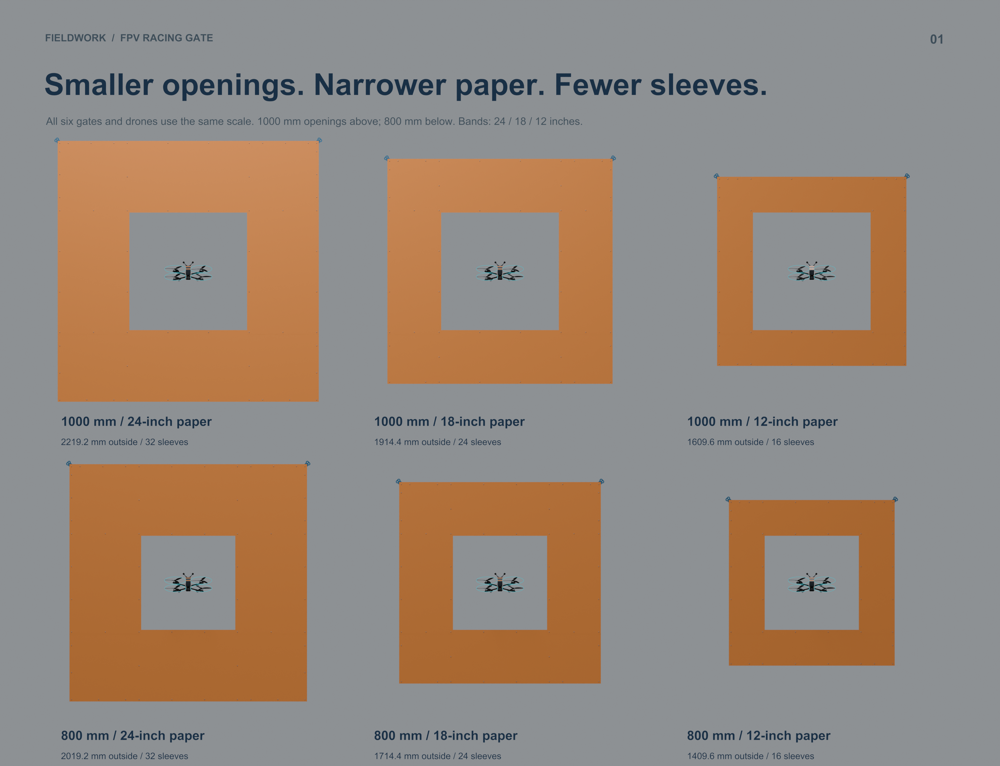
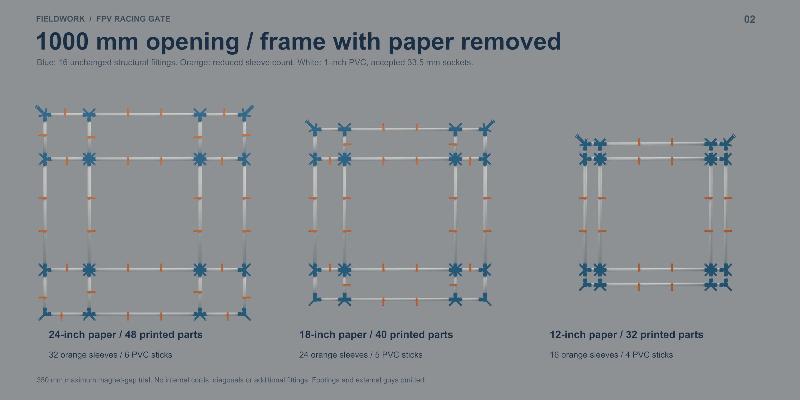

# Compact gates: 1000 / 800 mm openings and 24 / 18 / 12-inch paper

**Use fewer sleeves, not the original 48.** With the current accepted fittings and a trial maximum edge-magnet gap of 350 mm, the compact gates need **32 / 24 / 16 sleeves** for **24 / 18 / 12-inch paper**, respectively. Both openings use these counts. Smaller paper bands reduce PVC, paper and sleeve requirements while keeping the chosen opening unchanged.

**Suggested next build: 1000 mm opening with 12-inch paper.** It uses **32 printed parts, 1.883 kg PETG and 74h 21m**, versus 64 parts, 2.325 kg and 94h 28m for the current large gate. It retains about 299 mm centered side clearance to the imported MK4's full propeller sweep. The 800 mm version has 199 mm side clearance and saves one more PVC stick, but uses the same printed parts at this magnet-spacing target.

[Blender study](Compact_Gate_Study.blend) · [Visual PDF](Compact_Gate_Study.pdf) · [Render gallery](index.html) · [Comparison CSV](Comparison.csv) · [Detailed data and checks](study.json)

**Workshop cutting:** [PVC cut guide PDF](PVC_Cut_Guide.pdf) and [cut tables / ratchet stock layouts](PVC_Cut_Guide.md). The ratcheting-cutter guide reduces the 1000 mm / 24-inch variant to five PVC sticks; the comparisons below retain the earlier conservative saw allowance of six.

## Material and print comparison

| Opening mm | Paper width | Outer mm | Sleeves / all parts | PETG kg | Print time | PVC sticks | Priced subtotal |
|---:|---:|---:|---:|---:|---:|---:|---:|
| 1480.8 current | 24 in | 2700.0 | 48 / 64 | 2.325 | 94h 28m | 8 | $69.53 |
| 1000 | 24 in | 2219.2 | 32 / 48 | 2.104 | 84h 20m | 6 | $55.86 |
| 1000 | 18 in | 1914.4 | 24 / 40 | 1.993 | 79h 18m | 5 | $49.03 |
| 1000 | 12 in | 1609.6 | 16 / 32 | 1.883 | 74h 21m | 4 | $42.19 |
| 800 | 24 in | 2019.2 | 32 / 48 | 2.104 | 84h 20m | 5 | $50.52 |
| 800 | 18 in | 1714.4 | 24 / 40 | 1.993 | 79h 18m | 4 | $43.69 |
| 800 | 12 in | 1409.6 | 16 / 32 | 1.883 | 74h 21m | 3 | $36.85 |

Times and PETG use local **Bambu Studio A1 Mini PETG slices**, with seven-sleeve batch plates and exact tail quantities. No new fitting shapes are needed. 0.4 mm nozzle, 0.20 mm layer, four walls, 20% infill, textured PEI and supports disabled. The new two- and four-sleeve plates were sliced and verified; other recipes reuse the current verified production slices. These are slicer estimates, not measured machine runtimes. Full quantities assume printing from zero; subtract already printed fittings.

Costs use the owner's prices: $39.59 / 4 kg PETG, $19.99 / 800 magnets and $5.34 / 10-ft PVC stick. Subtotals include allocated PETG, both magnets of every pair, and whole PVC sticks. **Paper prices for each width were not supplied and are excluded**, along with guy lines, ground support, tax, electricity and failures. Roll yields below help compare actual paper prices without inventing prices.

## Where the parts disappear

All versions retain **2 bottom elbows + 2 top guy elbows + 8 tees + 4 crosses = 16 structural fittings**. These carry the orthogonal PVC grid and outer/inner paper supports. All accepted 33.5 mm bores, 30 mm insertion depths, guy eyes, paper alignment guides and magnet skins stay unchanged. This is a compatible layout reduction rather than a new lightweight fitting design.

- **24-inch band:** 16 sleeves on eight long pipes (two each), plus 16 sleeves on short pipes.
- **18-inch band:** 16 long-pipe sleeves, plus eight short-pipe sleeves at the paper overlap seams. Eight outer-corner sleeves disappear.
- **12-inch band:** 16 long-pipe sleeves. All sixteen short-pipe sleeves disappear; the fitting-mounted magnets cover the short sections and overlap seams.

Blue fittings and orange sleeves are render colors for identification; the user's filament is black. Magnets remain 18 mm in from the paper edges. Lowering sleeve count removes the sleeve and its two magnets. Empty, unused cross pockets stay unpopulated.

**Why 800 mm does not yet print faster than 1000 mm:** two intermediate magnets per long edge produce maximum long-edge gaps of **278.7 mm** and **345.3 mm**, respectively. One sleeve on an 800 mm long edge would create **418 mm** gaps, exceeding this study's 350 mm target. A later sparse-retention test could try that; it is not included in these six layouts.

**The next bottleneck is the large fittings.** The 16 structural pieces alone consume **1.661 kg / 63h 51m**, about 88% of the 12-inch version's PETG. The 12-inch layout halves the total part count but reduces PETG by **19.0%** and printer time by **21.3%**. Major further print savings require redesigning those fittings, not merely making the paper narrower. The complete 12-inch queue fits nominally within two 1 kg spools, with about 117 g spare before failures. No version here fits one spool. The 18-inch queue nearly exhausts two spools, so allow reserve.

## Paper, PVC and magnets

| Opening / band | 16 short PVC cuts mm | 8 long PVC cuts mm | PVC used m | Paper used m | Paper area m² | Gates / 100-ft roll | Individual magnets |
|---:|---:|---:|---:|---:|---:|---:|---:|
| 1000 / 24 in | 389.6 | 1080.0 | 14.874 | 6.5824 | 4.013 | 4 | 120 |
| 1000 / 18 in | 237.2 | 1080.0 | 12.435 | 5.9728 | 2.731 | 5 | 104 |
| 1000 / 12 in | 84.8 | 1080.0 | 9.997 | 5.3632 | 1.635 | 5 | 88 |
| 800 / 24 in | 389.6 | 880.0 | 13.274 | 5.7824 | 3.525 | 5 | 120 |
| 800 / 18 in | 237.2 | 880.0 | 10.835 | 5.1728 | 2.365 | 5 | 104 |
| 800 / 12 in | 84.8 | 880.0 | 8.397 | 4.5632 | 1.391 | 6 | 88 |

Each gate uses **four rectangular paper strips and four crosscuts**, keeping the full roll width: two top/bottom strips as long as the outer square, and two side strips as long as opening + 72 mm. Each side overlaps the top and bottom strips by 36 mm. No lengthwise ripping or corner patches are required. Roll yields assume a usable 30.48 m roll with negligible trimming allowance; allow extra for repairs or damaged paper. Paper area includes overlap. Compare roll cost per gate as **roll price divided by the whole-gate yield**, with leftover paper retained.

For 12-inch paper the short PVC cut is **84.8 mm**. Insert 30 mm at each end, leaving **24.8 mm** exposed between socket mouths. Do not attempt to add a short-pipe sleeve there. The actual fitted meshes were checked at these positions: no intersecting fitting pairs, and no unintended plastic visible beyond the paper. The diagonal guy ears intentionally remain exposed. Dry-fit one corner with your cutter before cutting all sixteen short pieces.

The stock layouts use 3048 mm sticks with 10 mm trimming reserve and 3 mm per cut allowance. A two-length integer packing check confirms the listed stick counts are minimal under those allowances. A ratcheting cutter does not remove a saw kerf; keeping the allowance provides a conservative measuring/trim margin. Pipe budgets exclude feet or other ground support.

A narrower band uses less material and presents less solid area to the wind, but does not establish a wind rating. The 350 mm edge-magnet target is a **layout assumption**, not a measured paper peel/tear limit. Paper grade, dampness, tension and gusts matter. Start with the 12-inch layout and test one full border using the actual roll and magnets; add long-pipe sleeves if edges flap or lift. Retain front/rear guys and suitable grass anchors or hard-surface ballast from the current design.

## Full print queues

Counts below apply to either opening with the given paper width. Each large fitting prints individually. Each full sleeve batch contains seven sleeves.

| Paper | Bottom elbow jobs | Guy elbow jobs | Tee jobs | Cross jobs | Seven-sleeve batches | Tail sleeves on one plate | Total plate runs |
|---:|---:|---:|---:|---:|---:|---:|---:|
| 24 in | 2 | 2 | 8 | 4 | 4 | 4 | 21 |
| 18 in | 2 | 2 | 8 | 4 | 3 | 3 | 20 |
| 12 in | 2 | 2 | 8 | 4 | 2 | 2 | 19 |

[Bottom elbow](../corner_guide_elbow/sliced/ONE_ELBOW/ONE_ELBOW_A1Mini_PETG.3mf) · [Guy elbow](../corner_guide_elbow/sliced/ONE_DUAL_GUY_ELBOW/ONE_DUAL_GUY_ELBOW_A1Mini_PETG.3mf) · [Tee](../corner_guide_elbow/sliced/ONE_TEE/ONE_TEE_A1Mini_PETG.3mf) · [Cross](../corner_guide_elbow/sliced/ONE_CROSS/ONE_CROSS_A1Mini_PETG.3mf) · [Seven sleeves](../corner_guide_elbow/sliced/BATCH_MAG_SLEEVE/BATCH_MAG_SLEEVE_A1Mini_PETG.3mf)

Tail plates: [2 sleeves for 12-inch paper](sliced/TAIL_MAG_SLEEVE_2/TAIL_MAG_SLEEVE_2_A1Mini_PETG.3mf) · [3 sleeves for 18-inch paper](../corner_guide_elbow/sliced/TAIL_MAG_SLEEVE_3/TAIL_MAG_SLEEVE_3_A1Mini_PETG.3mf) · [4 sleeves for 24-inch paper](sliced/TAIL_MAG_SLEEVE_4/TAIL_MAG_SLEEVE_4_A1Mini_PETG.3mf).

These projects are prepared locally; no job was sent to a printer. The current production folder remains unchanged.

## Build the selected size

1. Choose the opening and paper width; use the corresponding files below. Print only the missing parts.
2. Dry-fit one 84.8 mm corner section if using 12-inch paper. Confirm full 30 mm insertion at both ends and correct paper guide alignment.
3. Cut eight long and sixteen short PVC pieces. Slide sleeves onto each pipe **before** closing its ends with fittings. The cut CSV lists each sleeve center's distance from the pipe's cut start, with the start node encoded in its name.
4. Assemble the 4 × 4 node grid shown in scenes 02/03, placing the two guy elbows at the top. The cross has four ports; perimeter tees face into the grid. Clock sleeves toward the corresponding outer edge, opening edge or overlap seam as shown in Blender. The magnet CSV gives front-facing coordinates measured from the lower-left paper outline.
5. Cut the four paper rectangles. Align the outside corners and 36 mm side overlaps, then clamp at each populated magnet position. Confirm polarity before fixing magnets into their pockets.
6. Add suitable ground support and independent front/rear guys. Measure the actual opening and check friction retention, paper sag and magnet holding before flying. The render omits ground supports and guys for visibility.

- **1000 mm / 24 in:** [print queue](OPEN_1000_PAPER_24_Print_Queue.csv), [PVC cuts + sleeve positions](OPEN_1000_PAPER_24_PVC_Cuts.csv), [stock nesting](OPEN_1000_PAPER_24_Stock_Layout.csv), [paper cuts](OPEN_1000_PAPER_24_Paper_Cuts.csv), [magnet map](OPEN_1000_PAPER_24_Magnet_Positions.csv).
- **1000 mm / 18 in:** [print queue](OPEN_1000_PAPER_18_Print_Queue.csv), [PVC cuts + sleeve positions](OPEN_1000_PAPER_18_PVC_Cuts.csv), [stock nesting](OPEN_1000_PAPER_18_Stock_Layout.csv), [paper cuts](OPEN_1000_PAPER_18_Paper_Cuts.csv), [magnet map](OPEN_1000_PAPER_18_Magnet_Positions.csv).
- **1000 mm / 12 in:** [print queue](OPEN_1000_PAPER_12_Print_Queue.csv), [PVC cuts + sleeve positions](OPEN_1000_PAPER_12_PVC_Cuts.csv), [stock nesting](OPEN_1000_PAPER_12_Stock_Layout.csv), [paper cuts](OPEN_1000_PAPER_12_Paper_Cuts.csv), [magnet map](OPEN_1000_PAPER_12_Magnet_Positions.csv).
- **800 mm / 24 in:** [print queue](OPEN_800_PAPER_24_Print_Queue.csv), [PVC cuts + sleeve positions](OPEN_800_PAPER_24_PVC_Cuts.csv), [stock nesting](OPEN_800_PAPER_24_Stock_Layout.csv), [paper cuts](OPEN_800_PAPER_24_Paper_Cuts.csv), [magnet map](OPEN_800_PAPER_24_Magnet_Positions.csv).
- **800 mm / 18 in:** [print queue](OPEN_800_PAPER_18_Print_Queue.csv), [PVC cuts + sleeve positions](OPEN_800_PAPER_18_PVC_Cuts.csv), [stock nesting](OPEN_800_PAPER_18_Stock_Layout.csv), [paper cuts](OPEN_800_PAPER_18_Paper_Cuts.csv), [magnet map](OPEN_800_PAPER_18_Magnet_Positions.csv).
- **800 mm / 12 in:** [print queue](OPEN_800_PAPER_12_Print_Queue.csv), [PVC cuts + sleeve positions](OPEN_800_PAPER_12_PVC_Cuts.csv), [stock nesting](OPEN_800_PAPER_12_Stock_Layout.csv), [paper cuts](OPEN_800_PAPER_12_Paper_Cuts.csv), [magnet map](OPEN_800_PAPER_12_Magnet_Positions.csv).

## Blender, source and checks

Five scenes: six paper-on variants at the same scale; three bare 1000 mm frames; three bare 800 mm frames; both 12-inch-paper gates with the drone; and the compact lower-left corner. The source meshes are the actual accepted production parts. Geometry checks cover fitting-to-fitting intersections, paper coverage and magnet locations; queue checks cover exact quantities, bed fit and support-free slicing. Physical corner assembly, full-gate loads and paper retention remain untested.

The imported 7-inch MK4 is from Dendy / Printables 1515387, **CC BY-NC 4.0**, with the uploader's qualification that they did not create the underlying frame. The top battery is an assumed 110 × 40 × 45 mm addition. [Drone attribution and licenses](../../reference/geprc_mk4/ATTRIBUTION.md). Gate material and source code retain the project licenses. Clearances use the imported swept prop envelope, not just a static blade orientation.

Rebuild: `python scripts/plan_compact_gates.py`, `python scripts/slice_compact_gate_tails.py`, `blender -b -t 8 --python scripts/build_compact_gate_study.py`, then `python scripts/package_compact_gate_study.py` (ReportLab required for packaging). Existing production slices and the preceding drone Blender study are dependencies.
