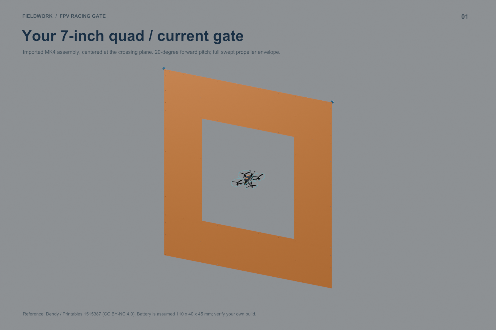
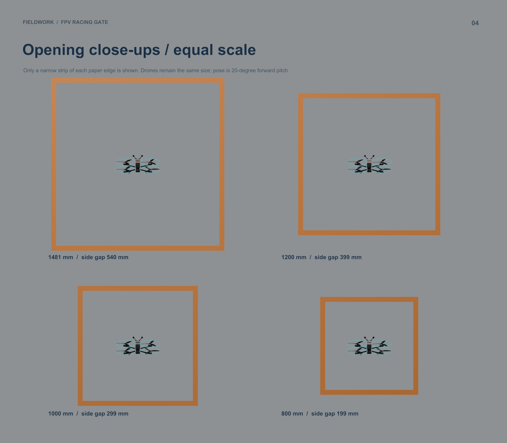

# MK4 7-inch drone / gate size study

The downloaded STEP assembly measures **401.3 mm across its full propeller sweep**. The current 1480.8 mm square opening leaves **539.8 mm on each side** when centered and approaching straight. A **1000 mm opening** is the suggested next trial: 299.4 mm per side and 54.4% less opening area. The 800 mm version is a tighter alternative, with 199.4 mm per side. These are geometry comparisons; approach speed, attitude and pilot accuracy determine the flying challenge.



[Open the Blender study](Drone_Clearance_Study.blend) · [Visual PDF](Drone_Clearance_Study.pdf) · [Render gallery](index.html) · [CSV measurements](Clearance_Comparison.csv) · [Raw calculations](clearance.json)

## Equal-scale comparison



All dimensions below are millimetres. Main pose: **20° forward pitch, zero yaw and roll**, with the projected swept envelope centered. Side and vertical values are gaps **per edge**, not total spare space. The outer dimensions retain 609.6 mm / 24-inch paper bands.

| Square opening | Outer square | Left / right gap | Top / bottom gap | Minimum side gap over level yaw |
|---:|---:|---:|---:|---:|
| 1480.8 | 2700.0 | 540 | 656 | 503 |
| 1200.0 | 2419.2 | 399 | 515 | 363 |
| 1000.0 | 2219.2 | 299 | 415 | 263 |
| 800.0 | 2019.2 | 199 | 315 | 163 |

The last column considers the propeller envelope over every yaw angle with the drone level. It is a separate case, not a bound for every possible flight attitude. At 45° yaw, 30° roll and 20° pitch, the example envelope is **392 × 279 mm** in the gate plane; see scene 07. Centering means centering the projected envelope, which can differ from centering the flight controller.

## What was measured

- Imported the actual 119-component STEP assembly from the user-supplied ZIP; preserved dimensions and applied only unit conversion and upright orientation.
- Motor diagonal: **294.3 mm**. The manufacturer lists a nominal 295 mm wheelbase for its [Mark4-7](https://geprc.com/product/gep-mark4-frame/); this is a cross-check, not certification that the downloaded assembly matches the user's exact build.
- The downloaded blades reach a **179.9 mm swept diameter**, slightly above nominal seven inches (177.8 mm). Calculations use the larger measured CAD radius and a complete rotating disc at every motor, not the blades' static orientation.
- Main projected envelope: **401.3 mm wide × 169.7 mm high**, including the supplied antenna/camera geometry and an explicitly assumed **110 × 40 × 45 mm battery** with straps. The download has no battery. A different battery, antenna or propeller can change the result.
- Blender mesh tessellation uses a 0.4 mm deflection setting. Numbers are suitable for a sizing study, not submillimetre inspection. Clearances are to nominal paper opening edges, without flight error, paper flutter or structural deflection allowances.
- Cyan circles illustrate swept propeller boundaries; they are not physical guards. Feet, ground anchors and guys are omitted from these clearance views.

## How the smaller gates reuse the current parts

All four scenes retain the same **64 fittings / five part types**, accepted 33.5 mm bores, actual PVC diameter and 24-inch paper bands. For a size change, replace the eight long PVC members and shorten the paper; the sixteen 389.6 mm PVC members remain. Four sleeves per long member remain in this comparison. Print quantities and slicer estimates therefore stay unchanged; later sleeve optimization is separate work.

| Opening | Long PVC cuts | Top + bottom paper lengths | Side paper lengths |
|---:|---:|---:|---:|
| 1480.8 | 8 × 1560.8 | 2 × 2700.0 | 2 × 1552.8 |
| 1200.0 | 8 × 1280.0 | 2 × 2419.2 | 2 × 1272.0 |
| 1000.0 | 8 × 1080.0 | 2 × 2219.2 | 2 × 1072.0 |
| 800.0 | 8 × 880.0 | 2 × 2019.2 | 2 × 872.0 |

All paper strips are 609.6 mm wide. Side strips include 36 mm overlap at each end. Pipe lengths retain the production design's 30 mm socket engagement and center offsets. This is a study cut schedule, not a replacement for the current production kit: dry-fit and verify assembled opening dimensions before batch cutting.

## Blender views

1. `01_CURRENT_GATE_PASS` — current full gate and drone at crossing.
2. `02_CURRENT_CLEARANCE` — straight-on dimensions to the paper edges.
3. `03_FOUR_OPENINGS` — four complete gates at equal scale.
4. `04_OPENING_DETAIL` — equal-scale opening close-ups; paper bands are cropped for visibility.
5. `05_DRONE_REFERENCE` — enlarged imported assembly, assumed battery and swept props.
6. `06_SMALLER_GATE_PASS` — suggested 1000 mm trial opening.
7. `07_ATTITUDE_COMPARISON` — straight and banked/turned examples in a 1000 mm opening.

Scenes 01 and 06 have a simple translation animation, frames **1–80**, crossing at **40**. This illustrates passage through the opening, not a flight dynamics simulation. The saved Blender file embeds the drone mesh and can be opened without the source ZIP.

## Source, license and reproduction

Drone reference: **Dendy**, [Printable parts for GEPRC MK4 7in FPV drone frame](https://www.printables.com/model/1515387-printable-parts-for-geprc-mk4-7in-fpv-drone-frame), supplied under **CC BY-NC 4.0**. Dendy explicitly disclaims original authorship of the included MK4 frame. See [attribution, license and modifications](../../reference/geprc_mk4/ATTRIBUTION.md) and the [supplied model PDF](../../reference/geprc_mk4/Printables_Model_1515387.pdf). Original gate material retains this project's separate license. No endorsement is implied.

Rebuild from the repository root after installing `cadquery-ocp` (conversion tested with OCP 8) and `reportlab` into an appropriate Python environment:

```sh
python scripts/import_geprc_reference.py --zip ~/Downloads/printable-parts-for-geprc-mk4-7in-fpv-drone-frame-model_files.zip
blender -b -t 8 --python scripts/build_drone_clearance_study.py
python scripts/package_drone_clearance_study.py
```

Conversion intermediates default to `/tmp/fpv-geprc-reference`; the 174 MB source STEP is not copied into this repository. The current production kit remains in `output/corner_guide_elbow/`.
